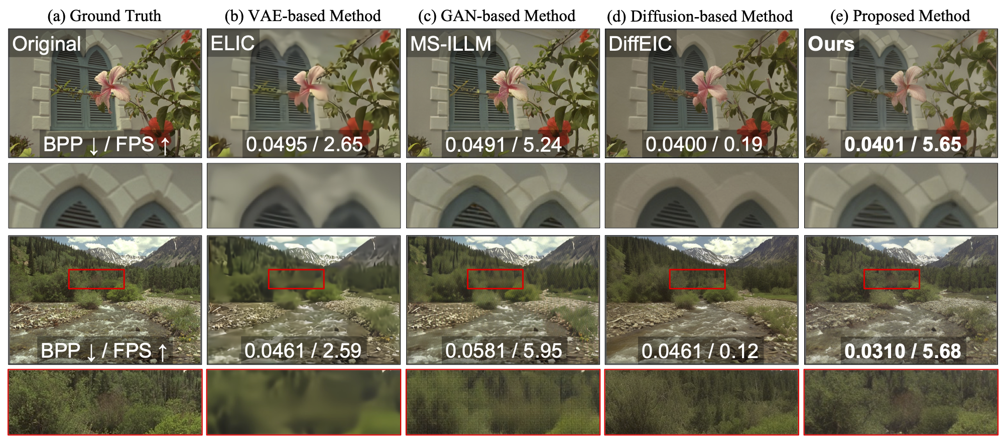

# Single-step Diffusion for Image Compression at Ultra-Low Bitrates
### Chanung Park, Joo Chan Lee, and Jong Hwan Ko

### [[Paper(arxiv)](https://arxiv.org/abs/2506.16572)]

## Method Overview



The proposed codec encodes images into a latent representation and reconstructs them with a single diffusion denoising step, enabling ultra-low-bitrate operation with fast decoding. The core design uses VQ-Residual training to factorize the latent into a structural base code (capturing global geometry/structure) and a learned residual (capturing high-frequency details), providing a stable scaffold while restoring fine textures. During decoding, rate-aware noise modulation sets the denoising strength according to the target bitrate (bpp)—stronger at lower bpp and milder at higher bpp. With the bitrate-conditioned noise level fixed, the decoder performs one denoising pass, eliminating multi-step overhead while preserving perceptual quality at extremely low bpp. This design achieves compression performance comparable to state-of-the-art methods and delivers ~50× faster decoding than multi-step diffusion codecs, substantially improving the practicality of generative compression.

## Setup
Our code is based on [ResShift](https://github.com/zsyOAOA/ResShift).

For installation:
```shell
git clone https://github.com/Freemasti/DiffO.git
conda env create -f environments.yaml
```

## Running

### Training

```shell
torchrun --standalone --nproc_per_node=1 --nnodes=1 main_diffusion_train_vq.py  --steps 2 --cfg_path configs/config.yaml --save_dir {save_path}
```

## Inference
```shell
python inference.py -i {input_path} -o {output_path}  -r {reference_path} --scale 1 --steps 2  --ckpt weights/ema_model_60000.pth --vqckpt weights/vq_model_60000.pth.tar --GT_vqckpt weights/GT_vq_model_60000.pth.tar --config configs/config.yaml  --ddim --one_step
```

## BibTeX
```
@article{park2025diffo,
  author    = {Park, Chanung and Lee, Joo Chan and Ko, Jong Hwan},
  title     = {Single-step Diffusion for Image Compression at Ultra-Low Bitrates},
  journal   = {arXiv preprint arXiv:2506.16572},
  year      = {2025},
}
```
